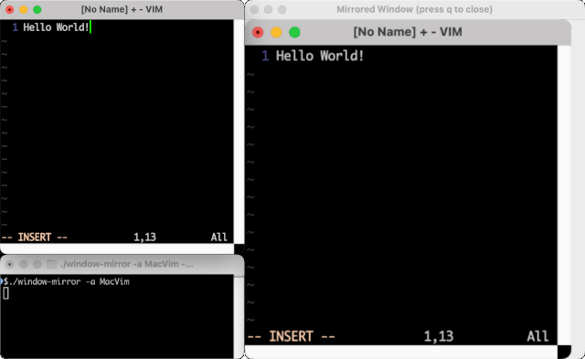

# window-mirror

Mirror a single window on another screen (macOS only, python)

This is a python script which runs on macOS only.
It relies on `pyside6` for creating its window and `pyobjc` to capture other windows via macOS Quartz.

When run, it creates a window that mirrors the contents of another window.
That's all.

This window can then be

- moved to a projector (for sharing only a single window with an audience)
- moved to a second screen (for pair programming),
- pinned to be shown on all desktops (to have a smaller/larger picture-in-picture version of a window available),
- or pretty much anything else that can be done with a window.



## Permissions

This script requires that its executing application (e.g., the terminal) has permission to record the screen.

## Usage

```bash
./window-mirror --app-name "Firefox"
```

## Installation

```bash
poetry install
```

## Uninstallation

```bash
poetry run poetry env remove python
```

## License

See [LICENSE](LICENSE)
